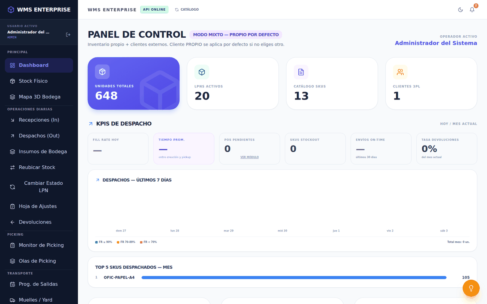
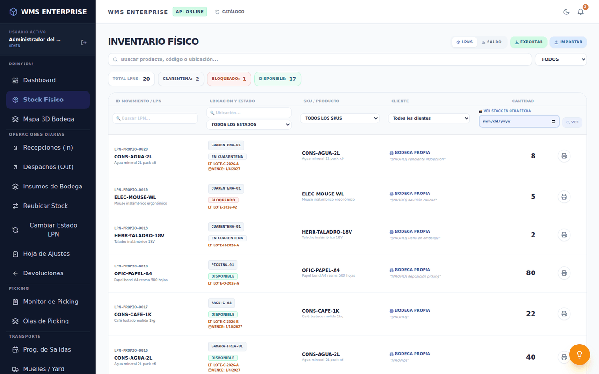
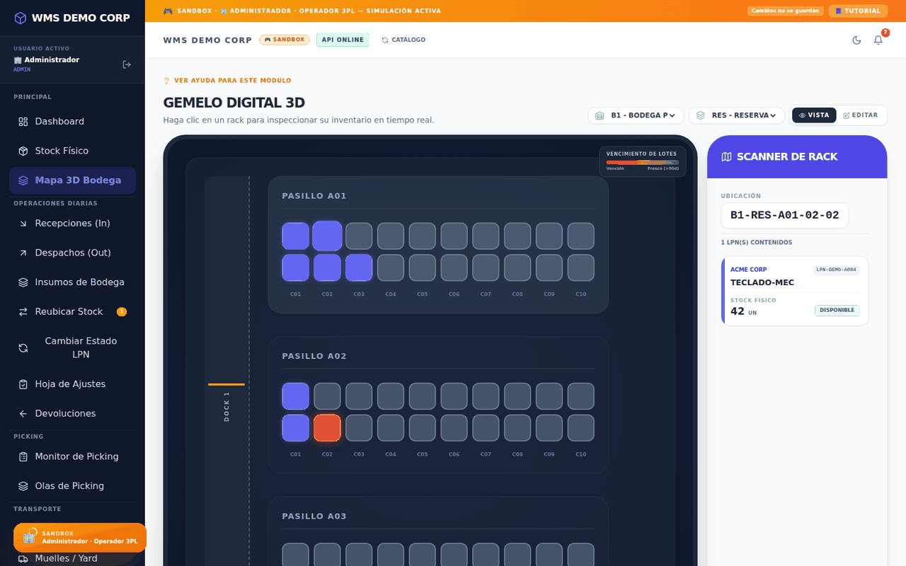
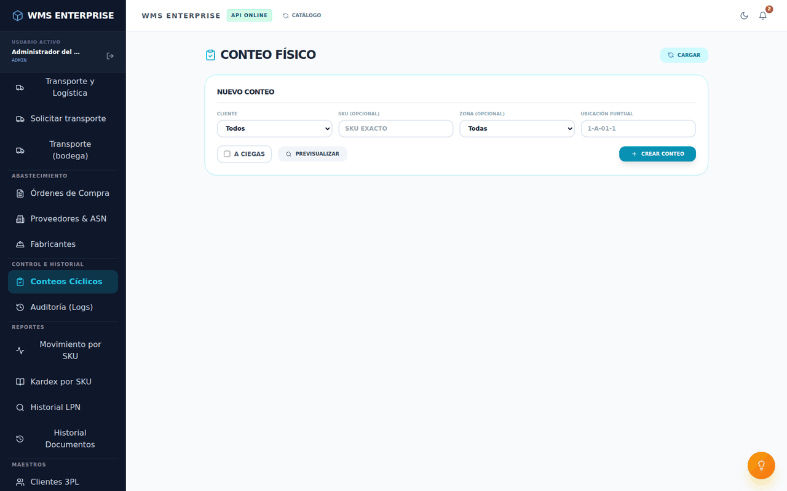
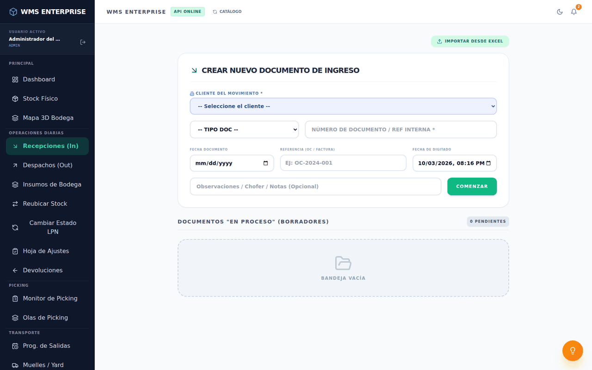
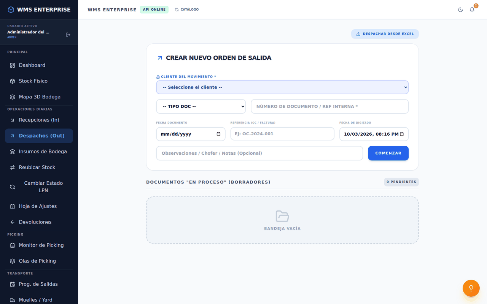

# WMS Enterprise

Sistema web de gestión de bodegas (WMS) para operaciones logísticas: controla el inventario por LPN y
ubicación, desde la recepción hasta el despacho, para una o varias empresas cliente (operación 3PL).

## Funciones principales

**Inventario y bodega**
- Inventario por **LPN** (unidad de carga con su identificador) y **ubicación**, con estados, lotes y
  fechas de vencimiento, y trazabilidad de cada movimiento.
- **Mapa de la bodega**: vista 3D de bodegas, zonas y ubicaciones con su ocupación.
- **Conteos cíclicos**, con modo ciego y aprobación de diferencias por un supervisor.
- Solicitudes de **reubicación** con aprobación.
- **Alertas de stock**: el sistema revisa cada hora los productos bajo su stock mínimo y los que vencen
  en los próximos 30 días, y los deja como notificaciones.

**Entradas y salidas**
- **Recepción** de mercadería, avisos de llegada (ASN) con proveedores y **órdenes de compra** con su
  recepción.
- **Despacho**, con programación por andén, cierre y comprobante de entrega.
- **Picking** por olas y tareas asignadas, **devoluciones** con inspección y armado de **kits**.
- Módulo de **transporte**: vehículos, transportistas, solicitudes y envíos.

**Administración**
- **Carga masiva desde Excel** (productos, clientes e inventario) con plantillas, vista previa y
  validación antes de guardar, y exportación a Excel.
- **Facturación por cliente** a partir de los eventos de almacenamiento y movimientos.
- **Auditoría**: historial de movimientos y de documentos (con anulación y su solicitud), y registro de
  accesos.
- **Usuarios con roles** (administrador, jefe de bodega, supervisor, operario, picker, auditor,
  coordinador de transporte, ejecutivo de cuenta, entre otros), con clientes y módulos permitidos por
  usuario. Autenticación con **JWT** y contraseñas con bcrypt.
- **Portal de clientes**: cada cliente consulta su inventario, movimientos y reportes.
- Reportes y KPI de despacho y ocupación, respaldos de la base de datos y un **modo de prueba** con
  escenarios de datos de ejemplo para recorrer el sistema con distintos roles.

## Tecnologías

| Capa | Tecnología |
|---|---|
| Frontend | React 18 (Create React App), Tailwind CSS, lucide-react, SheetJS (Excel) |
| Backend | Node.js, Express, JWT (jsonwebtoken), bcryptjs, Joi, express-rate-limit |
| Base de datos | PostgreSQL 15, con migraciones versionadas (`backend/migrations/`) |
| Despliegue | Docker Compose: base de datos, API y frontend servido por nginx |

## Cómo levantarlo en local

**Requisitos:** Docker con Docker Compose y Git.

```bash
git clone https://github.com/TheRenadeus/wms-enterprise.git
cd wms-enterprise
cp .env.example .env
```

Edita `.env` y define al menos:

- `DB_PASS`: contraseña de PostgreSQL.
- `JWT_SECRET`: secreto de las sesiones. Genera uno con `openssl rand -hex 32`.
- `SEED_ADMIN_PASSWORD` (opcional): contraseña inicial del usuario `admin`.

Luego levanta los servicios:

```bash
docker compose up -d --build
```

Abre **http://localhost** (la API queda en http://localhost:3000).

**Primer ingreso:** entra con el usuario `admin`.

- Si definiste `SEED_ADMIN_PASSWORD`, esa es la contraseña.
- Si no, el backend genera una aleatoria al primer arranque y la muestra una sola vez en su consola:

  ```bash
  docker compose logs wms-api | grep "Usuario inicial"
  ```

Cámbiala después de entrar.

Para detenerlo: `docker compose down` (los datos quedan en el volumen `wms-pgdata`).

`start.sh` y `stop.sh` son scripts del entorno del autor: levantan el backend con pm2 y lo exponen con
ngrok, sin Docker.

## Estructura del proyecto

```
wms-enterprise/
├── backend/            API REST (Node.js + Express)
│   ├── server.js       arranque: migraciones, middleware, alertas y rutas
│   ├── routes/         un módulo por área: inventario, recepción, despacho, conteos, transporte…
│   ├── migrations/     cambios de esquema versionados (001, 002, …)
│   └── middleware.js   autenticación JWT, roles y límites de solicitudes
├── frontend/           aplicación web (React)
│   └── src/            App.js, componentes y pestañas (tabs/) de cada módulo
├── db-init/            init.sql: esquema base que PostgreSQL carga al crear la base
├── docker-compose.yml  base de datos, API y frontend
└── .env.example        variables de entorno de ejemplo
```

## Capturas

Con los datos de ejemplo que trae el sistema (`SEED_DEMO_DATA=true`). El mapa de la bodega es del
modo de prueba (escenario Operador 3PL).

| Panel principal | Inventario por LPN |
|---|---|
|  |  |

| Mapa de la bodega | Conteos cíclicos |
|---|---|
|  |  |

| Recepción | Despacho |
|---|---|
|  |  |

## Hoja de ruta

Las mejoras planificadas están en [ROADMAP.md](ROADMAP.md).

## Autor

**Renato Cavalcanti**

- LinkedIn: [linkedin.com/in/renato-cavalcanti-ici](https://www.linkedin.com/in/renato-cavalcanti-ici)
- Portafolio: [therenadeus.github.io/portafolio-datos](https://therenadeus.github.io/portafolio-datos)
